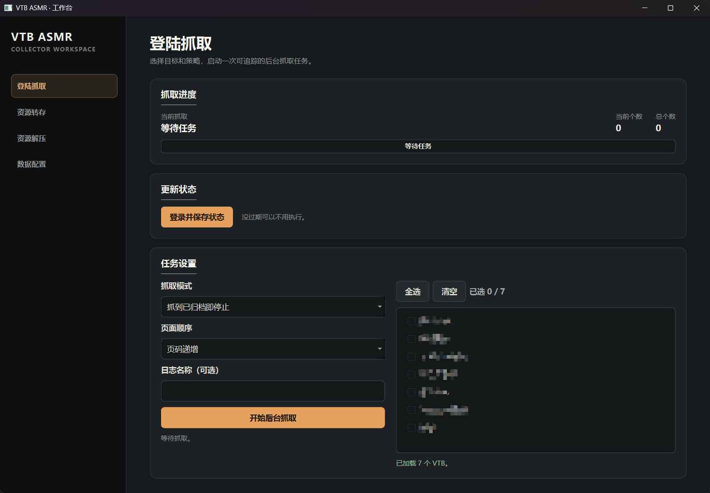
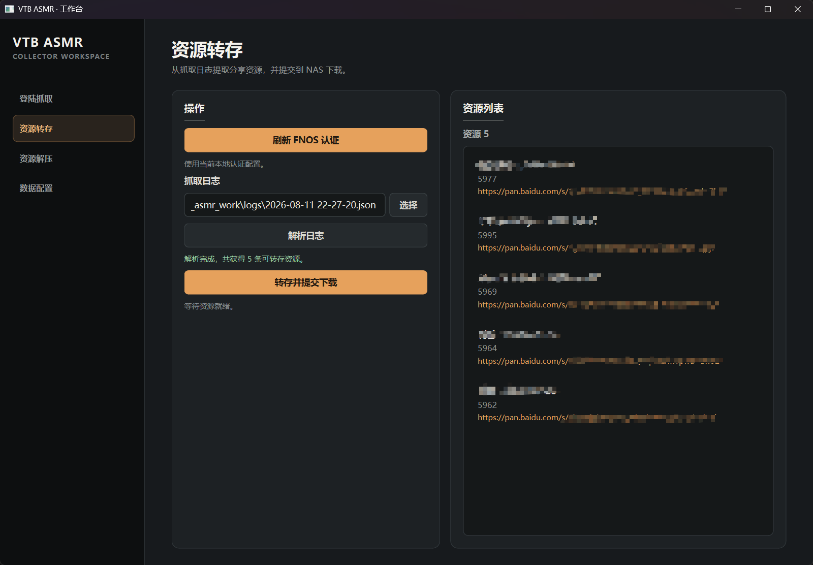
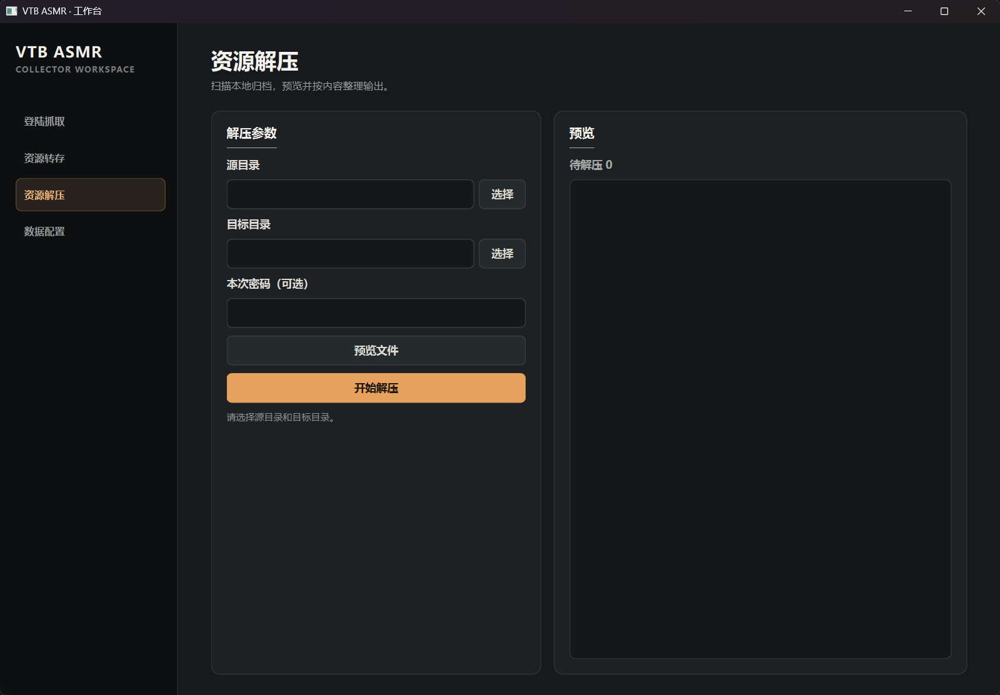
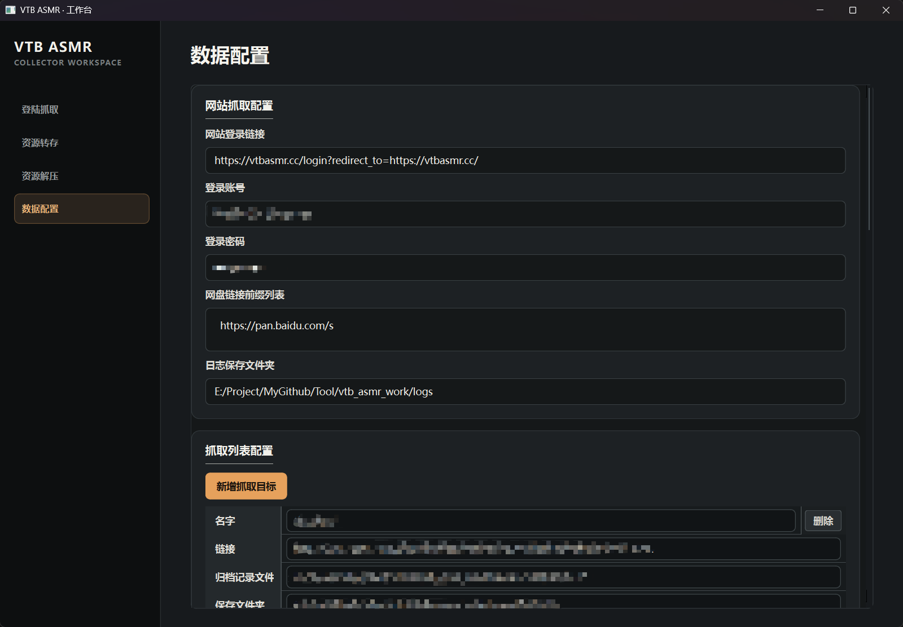

# 介绍

一个小工具，批量爬取特定网站`https://vtbasmr.cc/`上的百度网盘分享链接。顺带提供：百度网盘资源转存、fnOS/NAS 下载、解压，这几个功能。

# 工作流程
- 从网站爬取资源链接，生成日志。
- 从日志中解释百度网盘链接，批量转存到fnOS上的百度网盘。
- 调用fnOS上的百度网盘，把转存的资源下载到fnOS的磁盘上。
- 批量解压下载的资源。

# 环境要求
- 资源网站的会员。（如果爬取的资源需要付费）
- fnOS上百度网盘的会员。（无会员下载速度慢，fnOS的百度网盘会员可以半价）
- 7z解压工具。

# 配置说明
配置文件，保存在工作目录的`config`文件夹下。
初次启动，在程序的”数据配置“页面，补全下面的数据。
## 网站抓取配置
需要填写网站`https://vtbasmr.cc/`的登录账号、登录密码。
填写抓取日志保存的文件夹。
## 抓取列表配置
添加或者修改，想要抓取的Tag、Vtb信息。
- 名字：仅作显示，没什么影响。
- 链接：网站的某个Tag、Vtb对应的链接，该链接下有多个投稿、分页。
- 归档记录文件：归档文件是一个投稿的ID列表，用于保存已经抓取过的投稿ID，避免下次重复抓取。比如`archive/vtb.txt`
- 保存文件夹：抓取的投稿内容，保存的文件夹位置。比如`save/vtb/`
## fnOS配置
需要填写fnOS的访问链接、登录账号、登陆密码。用于自动获取fnOS的百度网盘应用的数据。
- 网盘转存文件夹：填写百度网盘中的路径，抓取的资源会被转存在这个文件夹下。比如`/vtbasmr.cc`
- 下载保存文件夹：填写fnOS中磁盘的文件夹路径，转存的资源下载到这个文件夹下。比如`/vol2/1000/download/vtbasmr.cc`
## 解压配置
填写7z的可执行程序的路径，解压功能使用命令行调用7z。
解压密码已经默认填写，除非网站更新。

# 使用说明
## 运行
执行根目录下的`batch_run.bat`，直接启动程序。
## 构建
执行根目录下的`batch_build.bat`，构建程序并生成在根目录下的`build`文件夹中。

# 页面展示
## 登录抓取

## 资源转存

## 资源解压

## 数据配置
